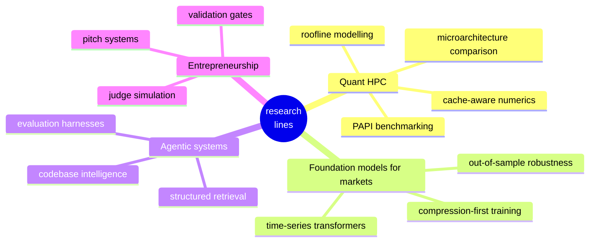

# Map of Projects

**A living index of what I'm building, studying, and shipping.**

Quant research · HPC · ML systems · trading · tooling. Curated, not auto-scraped.

 

---

## What this is

A curated map of the projects I own, maintain, and actively develop — grouped by the research and engineering lines I care about. Machine-readable version in [`projects.json`](./projects.json).

Think of it as a **table of contents** for my GitHub. The profile README is the cover; this is where you flip to the index.

> External clones and reading material I keep locally are intentionally **not** listed here. This file is for work I've written.

---

## Quant & HPC research

| Project | What it does |
|---------|--------------|
| [**finance-cache-hpc**](https://github.com/pbathuri/finance-cache-hpc) | Empirical L1 cache characterisation of four quantitative finance kernels (Cholesky, Monte Carlo, GARCH, GEMM) on AMD EPYC — PAPI counters, 28× layout effect, 1,657× phase transition. |
| [**Research_HPC_QFinance_Cache**](https://github.com/pbathuri/Research_HPC_QFinance_Cache) | Research notes and experiments on improving cache behaviour in quantitative finance workflows. |
| [**Quantitative-Modeling_Practice**](https://github.com/pbathuri/Quantitative-Modeling_Practice) | Quantitative finance modelling exercises following Wilmott — binomial pricing, stochastic calculus, risk-neutral valuation. |
| [**QuantumMCL-Spring26**](https://github.com/pbathuri/QuantumMCL-Spring26) (private) | Research thread on heuristic cache mechanisms for finance workflows. |

## ML systems & tooling

| Project | What it does |
|---------|--------------|
| [**Claude_Hackathon**](https://github.com/pbathuri/Claude_Hackathon) | WHO-aligned telehealth platform for underserved populations — voice/web intake, self-evolving medical knowledge graph, case triage, doctor dashboard. |
| [**ResumeForge**](https://github.com/pbathuri/ResumeForge) | Local-first, explainable resume tailoring with LangGraph · LaTeX compilation · Overleaf sync · SSE streaming. |
| [**entrepreneur-persona-skill**](https://github.com/pbathuri/entrepreneur-persona-skill) | Pitch coach for business-school competitions — validation gates, 75+ judge questions, 8 verticals, Clapp-style proposals, 12-slide decks. |
| [**entrepreneur-persona-llm**](https://github.com/pbathuri/entrepreneur-persona-llm) | Model-agnostic entrepreneurship mentor pack — works with ChatGPT, Gemini, Cursor, Copilot. |
| [**convo-ai**](https://github.com/pbathuri/convo-ai) · [**convo-ai-demo**](https://github.com/pbathuri/convo-ai-demo) | Duolingo-style conversation practice built on Streamlit. |
| [**abstraction-dictionary-book**](https://github.com/pbathuri/abstraction-dictionary-book) | Book project — the Abstraction Dictionary. |
| [**AI_Python_Projects**](https://github.com/pbathuri/AI_Python_Projects) (private) | Generative-model development practice repo. |

## Capital markets & trading

| Project | What it does |
|---------|--------------|
| [**Kory_The_Cat-NCAA**](https://github.com/pbathuri/Kory_The_Cat-NCAA) | NCAA bracket modelling / sports analytics. |

## Desktop & productivity

| Project | What it does |
|---------|--------------|
| [**deskflow-native**](https://github.com/pbathuri/deskflow-native) (private) | Cross-platform (macOS + Windows) desktop workflow manager — named profiles, non-destructive folder shortcuts. |
| [**Clap**](https://github.com/pbathuri/Clap) · [**Clap_OpsPilot**](https://github.com/pbathuri/Clap_OpsPilot) (private) | Agentic operations automation — OpsPilot. |

## Hackathons & case competitions

| Project | What it does |
|---------|--------------|
| [**LABLAB-Hackathon**](https://github.com/pbathuri/LABLAB-Hackathon) · [**LABLAB-Hackathon-Feb2-Startup**](https://github.com/pbathuri/LABLAB-Hackathon-Feb2-Startup) | LabLab hackathon submissions. |
| [**skillconnect-jk**](https://github.com/pbathuri/skillconnect-jk) | Jammu policy hackathon — skill-connect platform. |
| [**Photo_Recognizer_Image_Caption_Generator_Wikipedia**](https://github.com/pbathuri/Photo_Recognizer_Image_Caption_Generator_Wikipedia) | Image recognition + caption generation + Wikipedia lookup. |
| [**Robot-Simulation-environment**](https://github.com/pbathuri/Robot-Simulation-environment) | Robotics simulation environment. |

## Portfolio

| Project | What it does |
|---------|--------------|
| [**pradyotbathuri-website**](https://github.com/pbathuri/pradyotbathuri-website) (private) | Personal portfolio site — migrated from Wix to Next.js. |

---

## Research lines I'm chasing

---

## How to read this index

- **Each row links to the canonical GitHub repo.**
- **Private repos** are marked — available on request for recruiters / collaborators.
- The companion `projects.json` is the machine-readable version — same taxonomy, same links. Useful if you want to query my work programmatically.

---

Maintained by <a href="https://github.com/pbathuri">@pbathuri</a> · <a href="https://pradyotbathuri.com/">pradyotbathuri.com</a>

